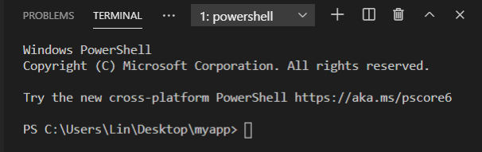
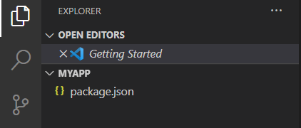
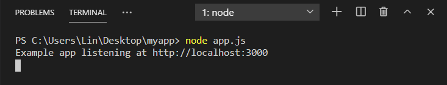

# Introduction to Installing Express.js

This section will focus on helping you set up an [**Express.js**](https://expressjs.com/) (or informally *Express*) is a web application framework for [**Node.js**](https://nodejs.org/). Express was originally released as free and open-source software, and it is used to provide server-side logic for web and mobile applications. Express also used in many popular development stacks like MEAN.

!!! Info
The MEAN Stack is a popular web development stack that is mainly used to create cloud-based applications using [**MongoDB**](https://www.mongodb.com/), [**Express.js**](https://expressjs.com/), [**AngularJS**](https://angularjs.org/), and [**Node.js**](https://nodejs.org/). It is popular because the MEAN stack can be written with only [**JavaScript**](https://www.javascript.com/).

## Installing Express.js

Before we begin with the installation, you need to create a folder will be used to store your application. This can be done through the graphical user interface (GUI) or through the Terminal in [**Visual Studio Code**](https://code.visualstudio.com/download) (VSC).

In order to provide better clarity, this guide will focus on providing instructions and screenshots for the Terminal.

1. Open VSC and look for the navigation bar and select [File] > [Open Folder] to find the new folder that you created.

2. Select [Terminal] > [New Terminal] from the navigation bar.


At this point, a new Terminal window will open. Please note that the Terminal window will be used for the majority of this section, so you will want to keep it open.


!!! success


3. Type "npm init" without the quotations in Terminal.


At this point, you will be prompted to create a *package.json* file. For the purpose of this guide, you can go ahead and press enter 3 times or until you see a prompt to create an entry point.


!!! success


!!! Info
A package.json file is a JSON file that contains metadata related to the project. It is used to manage dependencies, scripts, versions, and other features of the modules that your application uses.

4. Type "app.js" for the *entry point* and press enter for the remainder of the prompts in Terminal.


If you have successfully completed this step, you should see a package.json file inside of the Explorer tab in the vertical navigation bar.


!!! success



!!! Info
An entry point is the JavaScript file that will be used to execute your file. It is considered good practice to name your entry point "app.js".

5. Type "npm install express --save" (or the short form *npm install express*) in Terminal.


At this point, you will see the Terminal begin to download, install, and prepare Express for your project. Once completed, you will see a new folder called *node_modules* and a file called *package-lock.json* in the Explorer tab.


!!! success


!!! Info
The node_modules folder contains all of the dependencies from npm that your application requires to run.


!!! Info
The package-lock.json file is used to determine the specific versions of dependencies for your modules.

6. Select [File] > [New File] from the navigation bar and name the file "app.js".
7. Type the following code inside of your app.js file:

``` {.js .annotate}
const express = require('express'); (1)
const app = express(); (2)
const port = 3000; (3)

app.get('/', (req, res) => { (4)
  res.send('Hello World!'); 
})

app.listen(port, () => { (5)
  console.log(`Example app listening at http://localhost:${port}`);
})
```

1. This line of code will import the express module into your app.js entry point file.
2. This line of code will create a new Express application.
3. This line of code will store the number of the port that we will be using to connect to your localhost.
4. The GET method route will allow our application to send the string "Hello World!" as a response when we connect to our localhost. You will be learning more about HTTP methods like GET in a later section.
5. The app.listen() function is used to listen to a specified port for connections. For this application, we are using port 3000.


!!! Info
Localhost is the default name that refers to the current computer that is being used to run the virtual server.

1. Run your application from the Terminal.
> node app.js


If successful, you should see the success message that you typed in the app.listen() function from earlier.


!!! success


9. Open up your internet browser of choice and type "http://localhost:3000/" into the address bar.


Once the page loads, you should see "Hello World!" in your browser. This means that you have successfully installed and created your first working server! 👍


!!! success


## Conclusion

By the end of this section, you will have successfully learned the following:

- Used the Terminal to install Express
- Imported an Express module into your app.js file
- Created a working Express server on your localhost on port 3009

Great job 🤗. You can go ahead and click on the link below to move on to the next step:

**[Adding Routes]()**