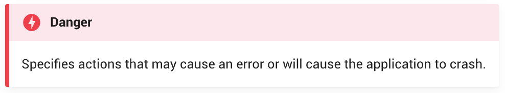
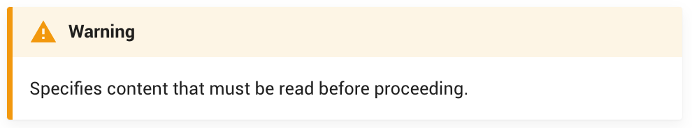
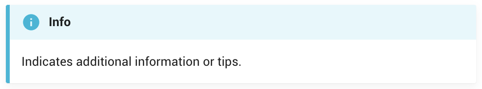

# Overview of Express User Documentation

Welcome! 👋 This documentation will guide you through setting up a [**Node.js**](https://nodejs.org/) project for building small to medium-scale RESTful APIs using [**Express.js**](https://expressjs.com/).

The goal of this documentation is to provide you with enough information to build your first Express application. We will also focus on best practices and various ways to optimize workflow when working collaboratively.

These are the topics of this document

- Structuring project files
- Enforcing code standards
- Installing Express
- Writing routes
- Using middleware

## How We Collaborated Together

This user guide assignment occurred while our classes were completely held online. Our main form of communication was over Discord instant messaging after we brainstormed our guide idea and instruction outline over Zoom.

We used Git and GitHub to collaborate on the documentation. With every new page, we would create a new branch to keep our work separate until we were ready to merge to the master branch.

## How We Created Our Guide

Our guide was created using our knowledge from setting up and using Express servers in COMP 2523 Object-Oriented Programming 1. We referenced the official [Express documentation](https://expressjs.com/) to supplement our experiential knowledge. We reflected on the difficulties we had encountered while working with Express and in group projects to keep our instructions clear, complete, and concise.

### Using MkDocs

We chose to use MkDocs as our static site generator as we liked the appearance of the [Material for MkDocs](https://github.com/squidfunk/mkdocs-material) theme, and the components provided by MkDocs. One of our team members had access to additional plugins which gave us the flexibility to customize the appearance of our documentation even further.

### Using Markdown

This was the first time writing extensively in markdown for two of our three group members. We learned how to style text using markdown from our COMM 2116 Business Communications 2 and developed our skills over the course of writing this documentation.

### Using VS Code

All three members of the group used VS Code to write our markdown files. We previewed the markdown using VS Code's built-in markdown preview, but we had to serve our guide with MkDocs to see the accurate rendering of our styles.

### Using a Style Guide

We loosely used the [Google Developer Documentation Style Guide](https://developers.google.com/style) to give our writing uniformity. We had previously used this style guide and its clear documentation made it an attractive style guide to reference.

We used codeblocks to represent code. MkDocs allowed us to make annotations inside the code block that show additional information when clicked. This allowed us to explain specific lines of code without disrupting the visual flow. MkDocs also had the feature to highlight lines of code. We used this feature to highlight new additions or changes to a repeating code block.

We used a quote block to visually differentiate Terminal commands from code.

### Learning Best Practices For Web Writing

In addition to user guides, developers also write documentation for their peers and company stakeholders. Most of this writing exists in a web format. As such, it is important to construct documents that maximize readability on the web.

#### Readability

People read technical writing to retrieve information and not for pleasure (typically). We streamlined our writing to be clear, concise, and complete to provide the necessary information as effectively as possible. 

We ensured that every procedure page had an overview that would give the reader a preview of the topic before going through the detailed steps. At the end, we included a conclusion to summarize what the reader would have accomplished from following the guide.

We used MkDocs' admonitions to highlight any information we wanted to stand out to the reader.

<figure>
  <figcaption>Specifies actions that may cause an error or will cause the application to crash.</figcaption>
  
</figure>

[comment]: <> (<figure>)

[comment]: <> (  <figcaption>Specifies actions that may lead to unexpected behaviour.</figcaption>)

[comment]: <> (   (  src="docs/pages/images/admonitions/failure.png")

[comment]: <> (  alt="The failure admonition.">)

[comment]: <> (</figure>)

[comment]: <> (<figure>)

[comment]: <> (  <figcaption>Specifies actions that may cause an error.</figcaption>)

[comment]: <> (   (  src="docs/pages/images/admonitions/bug.png")

[comment]: <> (  alt="The bug admonition.">)

[comment]: <> (</figure>)
<figure>
  <figcaption>Specifies content that must be read before proceeding.</figcaption>
  
</figure>
<figure>
  <figcaption>Indicates additional information or tips.</figcaption>
  
</figure>
<figure>
  <figcaption>Indicates what success looks like.</figcaption>
  
</figure>

#### Chunking

Due to the nature of our topic, we anticipated long informative pages. This can easily become difficult for a reader to follow. Knowing this, we focused on using sub-headings and figures to guide the reader.

We achose a navigation style (from MkDocs) that would show the subheadings for the current page as nested links. This allows our reader to gauge the relevancy of the material and to jump to a specific section if they desired.

#### Tone

This documentation is intended for the following users who are searching for a clear guide to setting up Express for a collaborative project:

- Beginner to intermediate developers who need to setup a backend for a personal project.
- Software development teams working on small or medium-sized web applications.

Therefore, we chose to write in a casual tone as if we were explaining to a peer. We kept the jargon to a minimal as we did not want to confuse any beginner coders. Any specialized terminology included a hyperlink to an external resource if the reader needed further explanation.

## Conclusion

This documentation recorded our understanding of Express. The topic was challenging for us to write as we are still in the process of learning all the intricacies of the Express module.

Writing this documentation presented us the opportunity to practice writing clear instructions for our intended audience to read off the web.

This project tested our group's ability to communicate. As a group, we had an open line of communication where we regularly updated each other on our progress. Through solid teamwork, we helped each other adhere to a common style guide.

Thank you for your interest in our Express User Documentation.We hope this documentation can be a good reference for our readers and for ourselves in future projects. 

This document was built on: [Material for MkDocs](https://github.com/squidfunk/mkdocs-material)
